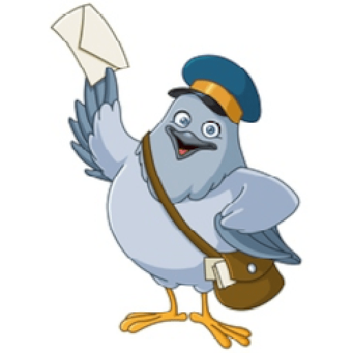

# Dispense



#### Connects two or more Slack organizations to bidirectionally share messages and files for public channels that share the same name.

# Setup
 - Run `./scripts/setup.sh`.
 - Follow the [bolt-python tutorial](https://slack.dev/bolt-python/tutorial/getting-started).
 - When creating the Slack Bot, make sure to Enable Socket Mode
 - When creating the Slack Bot, you'll need the following Bot Token Scopes:
 ```
 - app_mentions:read
 - channels:history
 - channels:read
 - chat:write
 - chat:write.customize
 - files:read
 - files:write
 - groups:history
 - im:history
 - links:read
 - links:write
 - users.profile:read
 - users:read
 ```
 - When creating the Slack Bot, you'll need to subscribe to the following Bot Events:
 ```
 - app_mention
 - file_created
 - file_shared
 - link_shared
 - message.channels
 - message.groups
 - message.im
 ```
 - Copy `dispense.conf.example`, replace with your Slack App ids and tokens.
 - Rename above to `dispense.conf` and create a new folder (e.g. `my_slack_team`) in the `slack_teams/` directory.
 - Do above for each Slack orginazation.

# Running
 - Run `./start.sh`.
 - Logs located in `./dispense.log`.

# Contributing
 - Feel free to open an issue or fork this project and submit a PR.
 - Run `./scripts/precommit.sh` before making commits.

# Road Map
 - Handle threaded messages (currently skips them).

# BUGS
 - Upload when multiple files (currently just take first attachment in list).
 - PID from `./start.sh` isn't the main python process so cannot simply kill `./slack_teams/<my_slack_team>/dispense.pid`.
